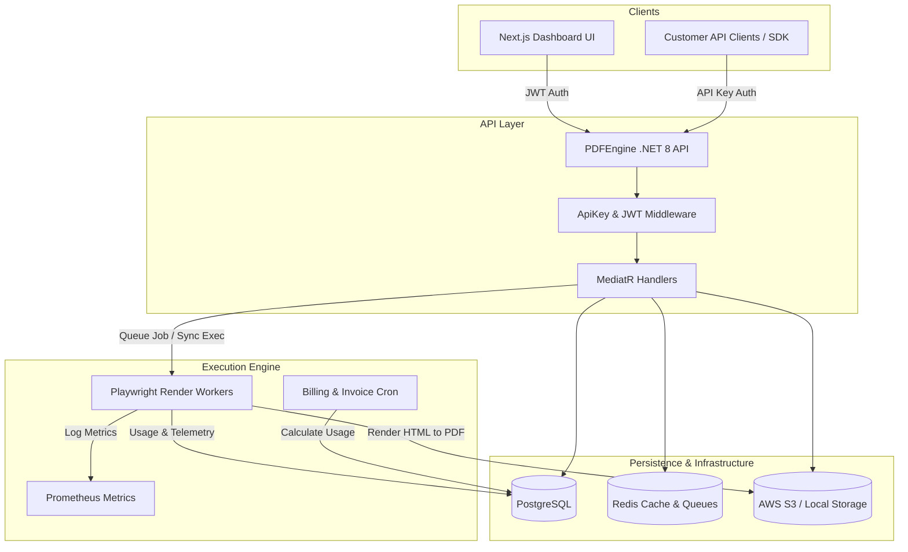

# PDFEngine: Enterprise Multi-Tenant PDF Rendering Infrastructure
## Product Architecture, Gap Analysis, & Roadmap

---

## 1. Product Overview & Vision
**What is PDFEngine?**
PDFEngine is a high-performance, enterprise-grade, multi-tenant SaaS platform designed to convert HTML/CSS/JS into pixel-perfect PDF documents at scale. 

**Why we started building this:**
Legacy PDF generation tools (like `wkhtmltopdf` or outdated Java libraries) are notoriously slow, fail to render modern CSS (like Flexbox/Grid), and are riddled with security vulnerabilities (SSRF). Modern businesses require dynamic, data-driven document generation (invoices, reports, tickets) that look exactly like they do in a browser.

**Our Target & Goal:**
To build an infrastructure that completely abstracts the complexities of headless browser scaling, queue management, and asynchronous asset loading. Our goal is to outshine competitors like **PDFShift** and **Raptor** by offering deep observability, zero-trust security (SSRF prevention), native webhook routing, and a frictionless developer experience (DX) out of the box, all while generating real, scalable revenue.

---

## 2. End-to-End Architecture

Our architecture is built on a modern `.NET 8` backend using CQRS (MediatR) and a `Next.js 14` frontend, heavily utilizing `PostgreSQL`, `Redis`, `Playwright`, and `AWS S3`.

---

## 3. Current Implementation Status (What is Working)

We have built a robust foundation with maturity surpassing many existing SaaS startups.

### Backend (API) - ✅ Working
- **CQRS & Clean Architecture:** Implemented via MediatR.
- **Tenant Isolation:** Global query filters in Entity Framework ensure strict data boundaries.
- **Playwright Engine:** Fully functional HTML-to-PDF rendering with isolated browser contexts.
- **SSRF Defense:** Built-in network interceptors prevent malicious internal network scanning.
- **Storage Strategy:** PDFs are dynamically stored locally (or via S3) and retrieved predictably using Job IDs.
- **2FA Lifecycle:** End-to-end multi-factor authentication (Enable, Verify, Disable, Recovery Codes).
- **Billing Foundation:** Idempotent invoice generation and usage calculation logic exists in the database.

### Frontend (UI) - ✅ Working
- **Playground:** Real-time PDF rendering via the API, with an inline iframe preview and successful download capabilities connecting to actual saved PDFs.
- **Usage Logs:** Real-time telemetry, waterfall timeline graphing, and functional "Download" buttons for past generated PDFs.
- **Settings & Security:** Working 2FA toggles, session listing, and password management UI.
- **Authentication:** JWT-based login and session management is fully wired.

---

## 4. Gap Analysis: What is NOT Working & Missing

To reach 100% completion and make this an industry-standard, professional tool, we must address the following UI/API gaps.

### 4.1. Dashboard Overview (Analytics)
- **Current State:** The charts (API Requests, Success Rate, Latency) display dummy data or random math.
- **Requirement:** Create an `[HttpGet("analytics")]` endpoint in `AccountController` that aggregates `UsageRecords` over time. The UI must fetch this data to render real D3/Recharts graphs.

### 4.2. API Keys Management
- **Current State:** The UI can list keys, but the "Create New Key", "Revoke", and "Roll" buttons are purely decorative or missing.
- **Requirement:** Wire the UI to the existing `[HttpPost("keys")]` endpoint. Add an `[HttpDelete("keys/{id}")]` endpoint to soft-delete/revoke keys. The UI must present the newly generated raw secret *once* in a secure modal.

### 4.3. Stripe Billing & Subscriptions
- **Current State:** The billing portal is entirely mocked. We built a `localStorage` persist for the mock card, but it does not talk to Stripe.
- **Requirement:** Integrate `@stripe/stripe-node` in the backend. 
  - **Flow:** User clicks "Subscribe to Pro" -> API creates Stripe Checkout Session -> User pays -> Stripe Webhook hits our `WebhooksController` -> API updates `Tenant.Plan` to Pro.

### 4.4. Webhooks Management
- **Current State:** The UI shows a list of webhooks, but lacks functionality to manage them or see delivery history.
- **Requirement:** 
  - **UI:** Add a "Create Endpoint" modal (requires URL and events). Add a "Delivery History" drawer showing HTTP status codes.
  - **API:** Ensure `PdfJob` completion dispatches events (e.g., `job.completed`, `job.failed`) to the registered endpoints via HTTP POST, and records the attempt in `WebhookDeliveries` table.

### 4.5. Background Async PDF Generation
- **Current State:** PDFs are currently generated synchronously (the HTTP request waits for the Playwright engine).
- **Requirement:** Implement the Async flow. Users submit to `/api/v1/pdf/jobs`. It returns a `jobId`. A background `HostedService` pops from Redis, renders the PDF, saves to S3, and fires a Webhook. The UI needs an "Async Mode" toggle in the Playground.

### 4.6. HTML Template Manager (Missing Feature)
- **Current State:** `SavedTemplates` exists in the DB, but no API or UI.
- **Requirement:** To compete with PDFShift, users must be able to upload Handlebars/Mustache HTML templates, and the API should accept a JSON payload to inject dynamic variables into the template before rendering.

---

## 5. Database Design & Models

### Existing & Created
- `Tenant` & `User`: Strict multi-tenant hierarchy.
- `ApiKey`: Hashed storage for API authentication.
- `UsageRecord`: Granular telemetry (Duration, Size, Success, Cost) per request.
- `PdfJob`: Queue tracking for async rendering.
- `TwoFactorRecoveryCode`: Secure backup mechanisms.

### Missing & Required for V1 Launch
- `SubscriptionTier`: Currently hardcoded in `PlanRegistry.cs`. Needs to be dynamic.
- `WebhookDelivery`: To store the request/response payloads when we ping customer webhooks.
- `PaymentMethod`: Links the `Tenant` to a Stripe `Customer_ID` and `PaymentMethod_ID`.

---

## 6. How to Outshine PDFShift & Raptor (Revenue Strategy)

To make this generate real revenue, we cannot just be "another PDF API". We must offer premium developer experience features:

1. **Zero-Trust SSRF Protection (Already Built):** Market this heavily. Most PDF APIs are vulnerable to SSRF. Ours actively resolves DNS and blocks internal IP scanning during browser rendering.
2. **Visual Debugging (Telemetry):** We already have the Waterfall Timeline UI. If an API request fails, developers can look at the dashboard and see *exactly* which CSS file or image failed to load inside the headless browser. This saves them hours of debugging.
3. **Bring Your Own Storage (BYOS):** Allow Enterprise customers to plug in their own AWS S3 bucket credentials in the Settings page. We render the PDF and push it directly to their bucket, bypassing our storage costs and ensuring compliance for them.
4. **Global Edge Caching:** Automatically cache generated PDFs at the Cloudflare/CDN edge if the HTML hash hasn't changed. Return the PDF in 10ms instead of 1000ms.

---

### Conclusion & Next Steps
The core rendering engine, tenant isolation, and UI foundation are incredibly strong. To reach 100% completion, the focus must shift entirely from "Core Infrastructure" to "User Workflows":
1. Wire up the API Key creation forms.
2. Replace the Mock Stripe Portal with a real Stripe Checkout integration.
3. Expose the `SavedTemplates` DB table to a new Dashboard UI page so users can manage templates visually.
